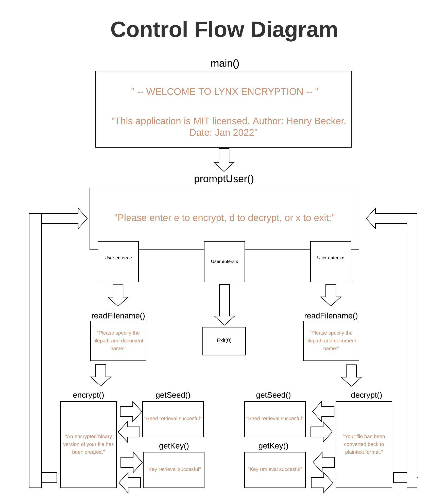

# LynxFileEncryption
A text file encryption application 

Wild Canadian Lynx photographed by Megan Lorenz   

  

# To Do
* put uneccessary cybersecurity info into notes repo

* run speedup tests using proj 6 code to test difference between assembly and C xor implementation

## Overview
The Lynx file encryption system was designed for efficient and reliable encryption of sensitive text data on a user's machine. I created this application in order to learn more about different encryption strategies, their strengths, and their weaknesses. I originally became curious after realizing I did not understand how the icloud keychain stored my passwords and other sensitive information. 

This project is really a proof of concept and a learning exercise. I did not spend too long on any one feature of the program so there are several weaknesses which I will discuss later.

### What is encryption?

### What is a block vs stream cipher 

### What is the OTP cipher 

Show XOR assembly 

Show the reversibility of the XOR

### What is pseudorandom number generation
What was Von neumman's technique. 

### What is my strategy for secret seed generation?
binary file creation time - seed must be secret - seed could be added into the file but then if its edited the info would be lost

Show bash command 

Show seed generation formula (or switch to using von neumanns) 

### keyboard to binary explanation
make explanation of keyboard input as ascii which is converted to binary that's stored in a 32 bit space (explain address size, addressability, word size, and byte addressible) (is 8 bits one byte the smallest addressable space in my computer?)

### Highlights for me
1. Using inline assembly for the first (but not the last) time
2. Learning more about the system command, sed, grep, and regex in order to use them
3. Learning more about ciphers, pseudorandom number generation, and the points of failure in different encryption strategies
3. making the ascii art lynx 

## choosing a seed
The seed is the creation time of the binary file (not the text file). It is important to note that some editors (inlcuding vim) will create an entirely new file during the edit process so if a user was to edit the binary file the seed would be lost and the encrypted data is no longer unencryptable (practically speaking of course). 

#### Using inode data for seed
The inode (index node) is a data structure in a Unix-style file system that describes a file-system object such as a file or a directory. Each inode stores the attributes and disk block locations of the object's data.[1] File-system object attributes may include metadata (times of last change,[2] access, modification), as well as owner and permission data.[3]

## Inline x86 assembly
https://www.codeproject.com/Articles/15971/Using-Inline-Assembly-in-C-C

https://www.eecg.utoronto.ca/~amza/www.mindsec.com/files/x86regs.html

    // An early computer-based PRNG, suggested by John von Neumann in 1946, 
    // is known as the middle-square method. The algorithm is as follows: 
    // take any number, square it, remove the middle digits of the resulting 
    // number as the "random number", then use that number as the seed for the 
    // next iteration.

#### Issues 
seed is set by file timestamp which is changed if file is edited by vim because vim creates a new file each time you edit.

filename generator separates file extension by finding first "." character so if there are more than one "." characters in a filename it will change the filename incorrectly.

It can take non .txt files which I think is a problem?

The leaks command line tool is a possible valgrind alternative

### integrating Java and C

Split them in independent parts and develop independently. I assume that your main program is written in Java and C is used for some low-level hardware glue. If I am correct, than I advise you to:
1. create a library in C
2. test it using Check (an excellent unit test framework for C) 
3. use JNI to access this library from Java

#### Overflow 
If overflow occurs the original text will be lost and unrecoverable. The data type that stores the plaintext as well as the ciphertext is of a fixed size. If an operation during the cipher causes overflow the inverse of that operation will not necessarily return the original plaintext. Arithmatic (logical?) shifts cannot be used for this reason.

#### Background
A block cipher consists of two paired algorithms, one for encryption, E, and the other for decryption, D.[1] Both algorithms accept two inputs: an input block of size n bits and a key of size k bits; and both yield an n-bit output block. The decryption algorithm D is defined to be the inverse function of encryption, i.e., D = E−1. More formally,[2][3] a block cipher is specified by an encryption function

Many modern block ciphers and hashes are ARX algorithms—their round function involves only three operations: (A) modular addition, (R) rotation with fixed rotation amounts, and (X) XOR.

These ARX operations are popular because they are relatively fast and cheap in hardware and software, their implementation can be made extremely simple, and also because they run in constant time, and therefore are immune to timing attacks. The rotational cryptanalysis technique attempts to attack such round functions.

### Choice of languages
I chose to use C to implement the encrypt and decrypt functions because I wanted to work at the lowest level possible when performing bitwise operations. C has good support for bitwise operations but more importantly the gcc C compiler allows one to write AT&T style x86 assembly opcodes inline within C functions. which is how I implemented the XOR function on each byte of the plaintext. Implementing the encrypt and decrypt functions in C with inline assembly significantly improved performance with large ciphertexts. The results of the tests are below 

I chose to implement this encryption module in C to make use of the well supported bitwise operations specifically the bitwise XOR which is commonly used in ciphers because it is secure with nonrepetitive keys, computationally inexpensive, and easy to reverse.

#### Strengths of Lynx

#### Weaknesses of Lynx

#### Stream cipher
Simply put, a stream cipher uses a cryptographically secure psuedorandom number generator (CSPRNG) to produce a key stream of arbitrary length, and then uses the resultant psuedorandom information to encrypt the plaintext by combining the two.

#### To create and retrieve key for a given file
1. create binary file during encryption process
2. use seconds of file creation time as seed for key during encryption
3. retrieve seconds of file creation as seed for key during decryption

## Add (Caesar Cipher)
Casaer shifted each letter in his military commands to make them appear meaningless to the enemy if they were intercepted. The weakness of the ceasar cipher is that each letter in any language has a given fre   uency of use. This use frequency can be thought of as the language's fngerprint. By comparing frequencies of cipher letters to the known freuency of letters in the language being encrypted with enough data one can determine the shift used to encrypt the original message. This is known as frequency analysis and is the most important weakness of the Caesar cipher.

Each letter in a message is shifted to one of twenty six possible letters. Therefore, there are 26 possible combinations for any message encrypted using the Caesar Cipher.

## XOR (Viginere Cipher) 
Because there is no pseudorandom number function I could implement a pseudorandom number generator in assembly to create a OTP like cipher. Additionally, the Viginere cipher could be used which is a less secure predecessor to the OTP method. The Viginere cipher uses the XOR operation based on an input key to encrypt the message. 

## The OTP (Vernam) Cipher 
The OTP cipher or One Time Pad cipher encrypts a message using a key of random numbers as long as the message itself. Each number in the key is used to shift each character in the message. Because there are 26 letters in the alphabet there are 26 additional combinations for each character in a message resulting in 

The OTP cipher has very little information leak. If the key is generated randomly the shifts of each character in the message will never fall into a repetitive pattern. This means the frequency distribution of characters in the cipher text will be uniform preventing the use of frequency analysis by a code breaker.  

While OTP is impossible to break, if software provides feedback on wether the message has been decrypted correctly the attacker could theoretically brute force each possible key until the system confirms the key is correct. Therefore, some systems limit the number of password entry attempts while other systems require keys large enough that brute force attack would take an impractical amount of time based on the current limits of computing power.

The XOR operator is extremely common as a component in more complex ciphers. By itself, using a constant repeating key, a simple XOR cipher can trivially be broken using frequency analysis. If the content of any message can be guessed or otherwise known then the key can be revealed. Its primary merit is that it is simple to implement, and that the XOR operation is computationally inexpensive. A simple repeating XOR (i.e. using the same key for xor operation on the whole data) cipher is therefore sometimes used for hiding information in cases where no particular security is required. The XOR cipher is often used in computer malware to make reverse engineering more difficult.

If the key is random and is at least as long as the message, the XOR cipher is much more secure than when there is key repetition within a message.[4] When the keystream is generated by a pseudo-random number generator, the result is a stream cipher. With a key that is truly random, the result is a one-time pad, which is unbreakable in theory.

# Calculate the number of possibilities of your cipher

## Perfect Secrecy
A cipher strategy accomplishes perfect secrecy if an attacker can not glean any additional information about the original message when given the ciphertext.

Say you want to encrypt a 10 letter message. Because there are 26 letters in the alphabet and the message is 10 letters long, there are 26^10th possible messages you could encrypt. This is called the message space. If a key to encrypt this 10 letter message is randomly generated, the key space will include 10 random numbers between 1 and 26. This is called the key space and also contains 26^10 possibilites. The key is used to create a ciphertext which is composed of 10 randomly shifted characters each of which has 26 possibilities making the ciphertet space 26^10 as well. This method accomplishes perfect secrecy because it is equally likely that each message in the message space will be paired with any key in the key space resulting in an equal probability of any ciphertext in the ciphertext space. Therefore, if an attacker is given the ciphertext, the best the attacker can do is guess any of the 26^10 possible keys and messages. In other words, the OTP method is perfectly secret because the message space is not narrowed down at all if the ciphertext is revealed. 

## Random vs Pseudorandom 
Perfectly random fluctuations occur constantly in nature. A sequence is random or "nondeterministic" if the next number in the sequence to be generated is impossible to determine in advance. Computers are deterministic because the output can always be determined if the current state and input is known. Therefore, computers cannot generate perfectly random numbers on their own. There are many algorithms that can mechanically simulate randomness which is called pseudorandomness. These algorithms rely on a seed which is chosen by the operator. The seed is then mutated by some operation to produce a pseudorandom number. The next seed is taken from this number and the same operation is performed to produce the next pseudorandom number. This process is repeated until the adequate number of pseudorandom numbers has been produced. Keep in mind the algorithm will produce the same sequence each time the same initial seed is entered. These algorithms are pseudorandom because the sequence of numbers will eventually repeat once the initial seed is regenerated by the algorithm. The length of the sequence before a pseudorandom sequence repeats is called the period. If a large enough seed is chosen and the algorithm is robust enough, the period will be large enough that the numbers generated will be random enough for all practical intents and purposes. 

## Speck Cipher
The OTP method requires a key as long as the message text. This can become very vomputationally intensive as the size of the message grows. ARX (Add Rotate Xor) ciphers are used in substitute of the OTP method because they are less computationally intensive and still provide robust security. 

## The Icloud Keychain
As a mac user I have been saved from password resetting by the icloud keychain many times. This apple password management application automatically saves passwords during login to web accounts. These passwords can then  be retrieved by loggin into the Keychain app using the admin password. I wanted to know how icloud Keychain works so I did a little research: Icloud Keychain uses 256-bit AES encryption and also uses elliptic curve asymmetric cryptography and key wrapping to store and transmit passwords and credit card information.

#### 256-bit AES encryption
AES-256, which has a key length of 256 bits, supports the largest bit size and is practically unbreakable by brute force based on current computing power, making it the strongest encryption standard.

#### elliptical curve asymetric cryptography

### SLS encryption

#### key wrapping

AES (Advanced Encryption Standard) and DES (Data Encryption Standard)

SHA hashing (SHA stands for Secure Hashing Algorithm)
Private key cryptography - communication 

confusion and diffusion are two properties of the operation of a secure cipher which were identified by Claude Shannon in his paper Communication Theory of Secrecy Systems, published in 1949.

confusion refers to making the relationship between the key and the ciphertext as complex and involved as possible; diffusion refers to the property that the redundancy in the statistics of the plaintext is "dissipated" in the statistics of the ciphertext. In other words, the non-uniformity in the distribution of the individual letters (and pairs of neighbouring letters) in the plaintext should be redistributed into the non-uniformity in the distribution of much larger structures of the ciphertext, which is much harder to detect.

Substitution = a is swapped for z
Permutation = the order of the swapped letters is scrambled 

Confusion 
Achieved using substitution 
Goal is to obscure the relationship between the ciphertext and the key

Diffusion
Achieved using transposition or permutation
Goal is to obscure the relationship between the ciphertext and plaintext

#### Block Cipher vs stream cipher
a block cipher is a deterministic algorithm operating on fixed-length groups of bits, called blocks.

Stream ciphers encrypt messages one bit at a time while block ciphers encrypt blocks of bits
Stream ciphers are faster. they're better when input size is not known.

Credit car number, security code, and expiration date = block cipher because the amount of data is the same each time. Card holder's name = stream cipher because names are of various lengths.

Thank you to Brit Cruise for the Kahn Academy cryptography course from which much of the below information was gathered. You can find the course here: https://www.khanacademy.org/computing/computer-science/cryptography/crypt/v/caesar-cipher

On a real application, the username and password information would be hashed and sent to a file on a remote server in a secure network but as a proxy I could just use a hidden file on the user's computer.

### The difference between how paswswords are treated and how sensitive data is treated
Passwords are hashed but sensitive data is encrypted 

How does the application authenticate a user with a password hash?
When the application receives a username and password from a user, it performs the hashing operation on the password and compares the resulting hashed value with the password hash stored in the database for the particular user. If the two hashes are an exact match, the user provided a valid username and password.
The benefit of hashing is that the application never needs to store the clear text password. It stores only the hashed value.

What are per user salts and iterative hashing capabilities?

What are the risks of using symmetric encryption instead of hashing?
By design, symmetric encryption is a reversible operation. This means that the encryption key must be accessible to the application and will be used for every password verification.

If the encrypted passwords are stolen, the attackers only need to determine the symmetric key used by the application. Once that key becomes known, through a breach or through brute force attacks on a weak key, all passwords are instantly decrypted and accessible. This is not a good place to be.

Hash functions essentially discard information in a very deterministic way – using the modulo operator. ... Because the modulo operation is not reversible. If the result of the modulo operation is 4 – that's great, you know the result, but there are infinite possible number combinations that you could use to get that 4.

#### Is hashing reversible?
Simple 5 bucket hash with 10 numbers you could figure out that its just taking the modulo of the number but you wouldn't be able to tell if the input was 1 or 6. Therefore, you can find an input that leads to an equivalent output but you can never say with certainty what the original input was. 

Take a simple mathematical operation like addition. Addition takes 2 inputs and produces 1 output (the sum of the two inputs). If you know the 2 inputs, the output is easy to calculate - and there's only one answer.

321 + 607 = 928

But if you only know the output, how do you know what the two inputs are?

928 = 119 + 809
928 = 680 + 248
928 = 1 + 927
...
Now you might think that it doesn't matter - if the two inputs sum to the correct value, then they must be correct. But no.

What happens in a real hash function is that hundreds of one-way operations take place sequentially and the results from earlier operations are used in later operations. So when you try to reverse it (and guess the two inputs in a later stage), the only way to tell if the numbers you are guessing are correct is to work all the way back through the hash algorithm.

If you start guessing numbers (in the later stages) wrong, you'll end up with an inconsistency in the earlier stages (like 2 + 2 = 53). And you can't solve it by trial and error, because there are simply too many combinations to guess (more than atoms in the known universe, etc)

In summary, hashing algorithms are specifically designed to perform lots of one-way operations in order to end up with a result that cannot be calculated backwards.

Update

Since this question seems to have attracted some attention, I thought I'd list a few more of the features hashing algorithms use and how they help to make it non-reversible. (As above, these are basic explanations and if you really want to understand, Wikipedia is your friend).

Bit dependency: A hash algorithm is designed to ensure that each bit of the output is dependent upon every bit in the input. This prevents anyone from splitting the algorithm up and trying to reverse calculate an input from each bit of the output hash separately. In order to solve just one output bit, you have to know the entire input. In other words, when reversing a hash, it's all or nothing.

Avalanching: Related to bit dependency, a change in a single bit in the input (from 0 to 1 or vice-versa) is designed to result in a huge change in the internal state of the algorithm and of the final hash value. Since the output changes so dramatically with each input bit change, this stops people from building up relationships between inputs and outputs (or parts thereof).

Non-linearity: Hashing algorithms always contain non-linear operations - this prevents people from using linear algebra techniques to "solve" the input from a given output. Note the addition example I use above is a linear operation; building a hash algorithm using just addition operators is a really bad idea! In reality, hashing algorithms use many combinations of linear and non-linear operations.

All of this adds up to a situation where the easiest way of finding a matching hash is just to guess a different input, hash it and see if it matches.

Lastly, if you really want to know how hard reversing a hash is, there's no better substitute than just trying it out for yourself. All good hashing algorithms are openly published and you can find plenty of code samples. Take one and try to code a version that reverses each step; you'll quickly discover why it's so hard.

#### hash collision attack
A Hash Collision Attack is an attempt to find two input strings of a hash function that produce the same hash result. Because hash functions have infinite input length and a predefined output length, there is inevitably going to be the possibility of two different inputs that produce the same output hash. If two separate inputs produce the same hash output, it is called a collision. This collision can then be exploited by any application that compares two hashes together – such as password hashes, file integrity checks, etc.

The odds of a collision are of course very low, especially so for functions with very large output sizes. However as available computational power increases, the ability to brute force hash collisions becomes more and more feasible.

For example, let’s say we have a hypothetical hash function. A collision attack would first start with a starting input value, and hash it.

Now the attacker needs to find a collision – a different input that generates the same hash as the previous input. This would generally be done through a brute-force method (trying all possible combinations) until one was found. Let’s say we found a collision for this input in our hypothetical hash function.

The attacker now knows two inputs with the same resulting hash.

#### Salted hashing
Salt makes hashes stronger. Since the entire hash changes even if just one letter of the plaintext word is changed, all a site needs to do to foil lookup tables is add some extra plaintext to the password before it’s hashed. The attacker will be able to read the plaintext salt since it’s stored in the database, but it forces them to recompute every possible combination of potential passwords and salts.

Of course, salted hashes can still be cracked. Hackers can just add the salt to the password they’re guessing, hash the combination, and wait for matches to pop up – a standard dictionary attack. Since modern GPUs can make billions of guesses per second, this isn’t at all infeasible, but it does make the process a lot more annoying. Failing that, brute-force attacks are slow but very effective.

#### Key stretching
Slow hashing algorithms, like PBKDF2 or bcrypt, use a technique known as “key stretching” to slow down dictionary and brute force attacks. This essentially involves setting the hash function to iterate a certain number of times (though it’s a bit more complex than just running the same thing over and over again), so that in order to reach the correct hash you have to use a lot of computing power. If a site is doing all this, their security is pretty good.

#### Reminder
Password security has made some big advances – and so has the art of cracking that security. Unfortunately, humans are still bad at password management, and databases don’t upgrade security as often as they should. In general, assume that whenever you create an account, the password is being stored with relatively weak security. If your password is common or a dictionary word, then it’s at a pretty high risk of being cracked. Make your passwords long, mixing letters, numbers, and symbols, and you’ll be helping hash functions do their best work.

#### Lookup/Rainbow table
a pre-generated table full of potential passwords and their hashes. 
Hashes aren’t hackproof, though. All an attacker has to do is run a dictionary of potential passwords through the hash function, then compare those hashes to the hashes in the database. When two hashes match, the hacker can just look at which password generated that hash.

Also note that it is standard practice for every header file is to define a macro of the same name (IN CAPS), and enclose the entire header between #ifndef, #endif. In C, this prevents a header from getting #included twice. This is known as the "internal include guard" (with thanks to Story Teller for pointing that out). All system headers such as stdio.h include an internal include guard. All user defined headers should also include an internal include guard as shown in the example below.

