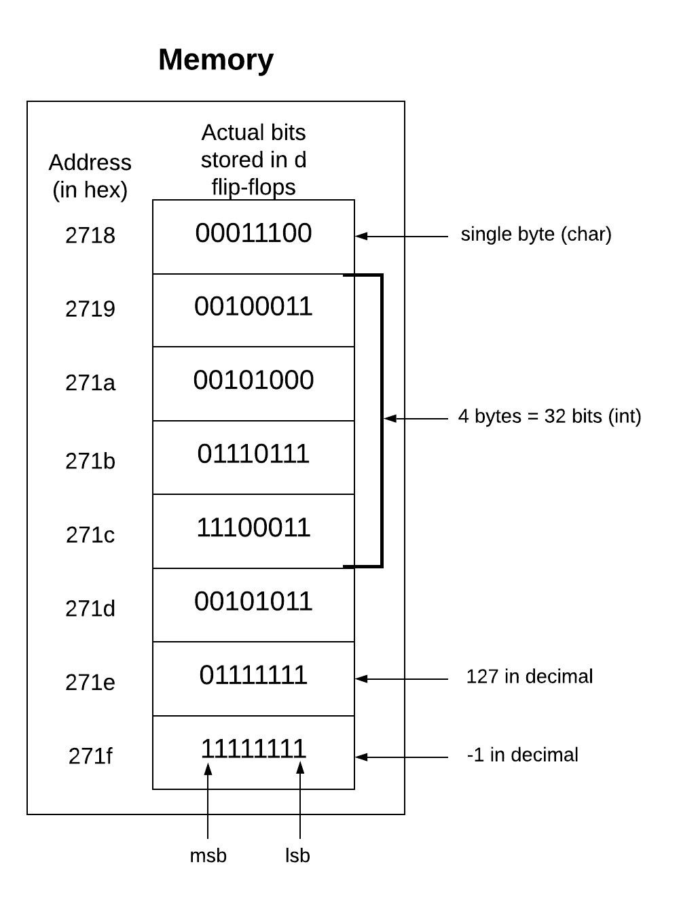

# LynxFileEncryption
A text file encryption application 


Wild Canadian Lynx photographed by Megan Lorenz <br /><br />

<br /><br/>


# To Do
* encrypt and decrypt each test to make sure its working at all sizes
* make a typescript of the output of a shorter quote (and include it in the test file)
* make a secret message binary file in test files
* cryptanalysis section
* center lynx photo and caption


The Lynx file encryption system dgitizes the OTP encryption technqiue to efficiently and reliably encrypt sensitive text data. I created this application while learning about different encryption strategies, their strengths, and their weaknesses. I got curious about encryption after realizing I didn't know how the icloud keychain stored my passwords and other sensitive information. This project is really just a proof of concept and a learning exercise. I did not spend too long on any one feature so there are several weaknesses which I'll discuss later. I've included my design plans, an explanation of my impelmentation, example input/output, and notes on what I learned during the process. I've also included a secret lynx encrypted message in the `secretMessage.lynx` file. I hope you enjoy!

## System Overview
The Lynx file encryption system digitizes the OTP (one time pad) encryption technique. In this stream cipher technique, new pseudorandomly generated keys are XOR'd with each character of the plaintext. I implemented the driver and function bodies in C but used inline assembly to perform the XOR operation on both encryption and decrpytion (see section on assembly below).  

#### The Encryption Process
1. Read in filename of text file to be encrypted
2. Create binary file with the same name as the plaintext file (with .lynx extension)
3. Retrieve the creation time (seconds term) of the binary file from the OS and use this as the seed for the pseudorandom key generator
4. XOR each character in the plaintext, with a new key and save this result to the binary file

#### The Decryption Process
1. Read in filename of binary file to be decrypted 
2. Create text file with same name as the binary file (with .txt extension)
3. Retrieve the key seed from the OS (seconds of creation time of the binary file)
4. XOR each byte of the binary file with the key and save this ascii character to the text file

This diagram shows each method and the abbreviated control flow.


### Perfect Secrecy
The cryptographer's goal is to create a ciphertext that leaks no information about the plaintext message. The One Time Pad encryption technique accomplishes perfect secrecy. The OTP technique creates a cipher text by performing an XOR on each character of the plaintext with a new randomly generated number for each character. This method is perfectly secret if the following conditions are met:

1. The key must be at least as long as the plaintext.
2. The key must be random (uniformly distributed in the set of all possible keys and independent of the plaintext.
3. The key must never be reused in whole or in part.
4. The key must be kept completely secret by the communicating parties. 

Randomly generated keys XOR'd with each character in the plaintext produce a perfectly secret ciphertext because each key in the key space would produce a different output and there is no statistical preference for any one key in the key space being selected over any other key in the key space. This means each character in the ciphertext is equally likely to be the actual plaintext character as it is any other possible character in the encoding. 

Although the OTP method is immune to cryptanalysis its main weakness is the need to store and transmit plaintext key information (either a key sheet or seed for a PSRNG) to the intended recipient of the ciphertext.

### Why is XOR used in the One Time Pad encryption? 
1. **XOR is balanced:** For a given plaintext input (0 or 1), the ciphertext result is equally likely to be either 0 or 1 for a truly random key bit.
2. **XOR is reversible:** An XOR of any pair of either the plaintext, key, or ciphertext will produce the third item. 

### Implementing XOR using inline x86 assembly
I think it is so cool that C has support for inline assembly. Because I have an intel based mac I needed to use the AT&T assembly syntax. 

```
 __asm__ ( "xorb %%bl, %%al;"
            : "=a" (currentChar)
            : "a" (currentChar), "b" (key) );
```

`xorb` = opcode for xor on a single byte of data <br />
`%%bl` = source register is the lowest 8 bits of the general purpose EBX register <br /> 
`%%al` = destination register (also a source register) is the lowest 8 bits of the general purpose EAX register <br />
`: "=a" (currentChar)` = save results of register a (low byte of EAX) into the currentChar variable <br />
`: "a" (currentChar), "b" (key) )` = save the value of the currentChar variable into register a and the value of the key variable key into register b <br />

I was hoping for a massive speedup using assembly but after testing the execution time I found the assembly was only slightly more efficient at plaintext sizes of 5,000 characters or more. The execution time was measured using the getrusage() function in the sys/resource.h include. The rdtsc() (Read Time-Stamp Counter) function in the (sys/time.h include) was also used to determine how many CPU ticks took place during program execution.

Execution times were compared using the following equation: 

```
Tc/Ta

Tc = execution time (milliseconds) of C XOR encryption implementation 
Ta = execution time (milliseconds) of assembly XOR encryption implementation 
```
200 word test: 123/124 = 0.992 (-0.008%)
1000 word test: 591/589 = 1.003 (0.003%)
5000 word test: 2743/2410 = 1.138 (14%)


I used the following resources when implementing this inline assembly:
https://www.codeproject.com/Articles/15971/Using-Inline-Assembly-in-C-C
https://www.eecg.utoronto.ca/~amza/www.mindsec.com/files/x86regs.html

### Pseudorandom Number Generation (PSRNG)
Perfectly random fluctuations occur constantly in nature. A sequence is random or "nondeterministic" if the next number in the sequence to be generated is impossible to determine in advance. Computers are deterministic because the output can always be determined if the current state and input is known (Finite state machine). Therefore, computers cannot generate perfectly random numbers on their own. There are many algorithms that can mechanically simulate randomness (pseudorandomness). These algorithms rely on a seed which is chosen by the operator. The seed is then mutated by some operation to produce a pseudorandom number. The next seed is taken from this number and the same operation is performed to produce the next pseudorandom number. These algorithms are pseudorandom because the sequence of numbers will eventually repeat once the initial seed is regenerated by the algorithm. The length of the sequence before a pseudorandom sequence repeats is called the period. If a large enough seed is chosen and the algorithm is robust enough, the period will be large enough that the numbers generated will be random enough for all practical intents and purposes. 

An early computer-based PRNG algorithm, suggested by John von Neumann in 1946, 
is known as the middle-square method: take any number, square it, remove the middle digits of the resulting number as the "random number", then use that number as the seed for the next iteration. I chose a simpler and much less secure PSRNG strategy for ease of implementation..

### Storage of characters vs encrypted binary
In most x86_64 architectures (and on my machine) memory is byte addressable. The addressability is the size in bytes of the smallest unit of memory that has its own address. In other words a byte addressable machine has an address for each byte of data stored in memory. The character data type in C is 1 byte and therefore each char has its own address. I used the `uint8_t` data type which is also a fixed size of 1 byte to hold the encrypted binary version of the character.




### Cryptanalysis
This is my attempt at crpytanalysis of Lynx ecnryption.

Say you want to encrypt a 10 letter message. Because there are 26 letters in the alphabet and the message is 10 letters long, there are 26^10th possible messages you could encrypt. This is called the message space. If a key to encrypt this 10 letter message is randomly generated, the key space will include 10 random numbers between 1 and 26. This is called the key space and also contains 26^10 possibilites. The key is used to create a ciphertext which is composed of 10 randomly shifted characters each of which has 26 possibilities making the ciphertet space 26^10 as well. This method accomplishes perfect secrecy because it is equally likely that each message in the message space will be paired with any key in the key space resulting in an equal probability of any ciphertext in the ciphertext space. Therefore, if an attacker is given the ciphertext, the best the attacker can do is guess any of the 26^10 possible keys and messages. In other words, the OTP method is perfectly secret because the message space is not narrowed down at all if the ciphertext is revealed. 


### Highlights for me
1. Using inline assembly for the first time
2. Learning more about the system command, sed, grep, and regex in order to get the file creation timestamp from the OS 
3. Learning more about infosec, encryption, pseudorandom number generation, and the points of failure in different encryption strategies

### Testing Instructions
If you are using an intel based mac running OSX Big Sur there is a chance this might also work on your machine (C with inline assembly is from my understanding almost never portable). Download the SRC directory and `cd` into it. run `make` to create the "lynx" executable. Run `./lynx` to run the executable. The testFiles directory contains .txt files that can be used to test encryption and decryption. Make sure (when prompted) to include the directory before the file name (for example: `testFiles/200wordTest.txt`). 

### The -1 bug
The `fgetc()` function is used when reading in characters from the plaintext during the encrypt method. The `fgetc()` function reads an int from the input buffer (which encodes for an ascii character) and then moves its pointer to the next buffer index. If `fgetc()` reads a -1 from the file it will interpret this as an end of file marker and will break the while loop and stop reading from the file. Once the while loop is broken `fclose()` is called next. The `fclose()` function writes the rest of the buffer to memory and appends the EOF constant after the last character written in memory. When this file is opened again, the function reading the file will interpret that EOF value as the end of the file. 

I noticed that the dencryption process often worked but at times it would stop decrypting prematurely. Eventually I figured out I was allowing the byte -1 (11111111) to be written to the file during the encryption process and during decryption these -1s were erroneously interpeted as the end of the file. In trying to prevent the encryption process from ever producing -1 I realized two things. Firstly: some characters present in the test files like so called "smart quotations" are not encoded by the ascii table and were stored as negative byte strings (with a 1 in the most significant bit) Secondly, during key generation, keys were created that had a 1 in the most significant bit. XORing bytes with 1s in the most significant bit led to the occasional generation of bit strings of eight 1s in a row. To fix the -1 bug I prevented the characters in the plaintext and the key values from ever exceeding 127 (binary: 01111111). 

#### Weaknesses 
* The seed for the pseudo random number generator is set as the creation time of the binary file. This is potentially problematic if the binary file is edited using vim because vim creates a new file during the edit process. 
* The filename generator separates file extension by tokenizing the filename string on the first "." character. If there is a "." character present before the "." indicating the file extension then the binary filename will not perfectly match the plaintext filename
* There is no stopping the user from encrypting non ".txt" files which could lead to undefined behavior during the encryption and decryption process.
* The program is not very portable because it uses inline assembly specific to the architecture of this machine. 
* The pseudorandom number generator is not robust enough to prevent against brute force attacks based on the processing power of modern computers.
* There is no safeguard against encrypting a file twice which will not properly produce the original plaintext if decrypted twice because the first binary file creation time will be overwritten during the second encryption.


